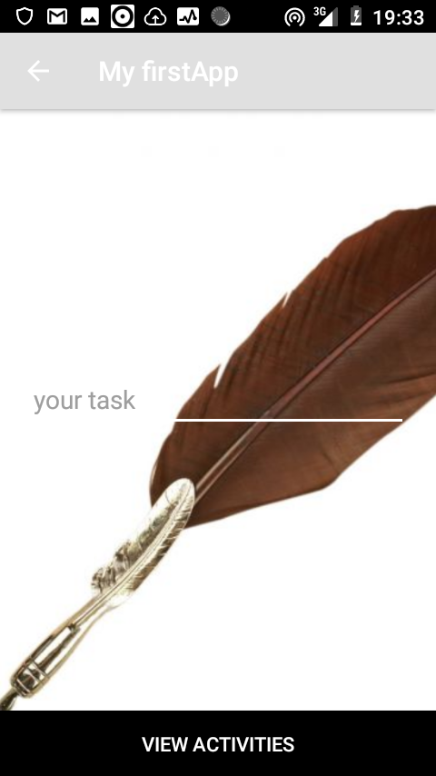
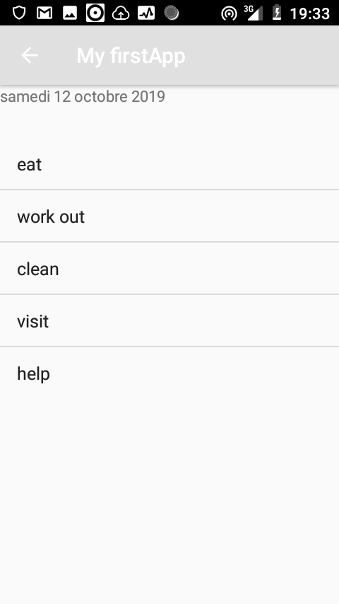

# My task

## Author

KARAMBIZI Amandine Gloria

## Contents are the following

 - [x] App description
 - [x]  Technologies used
 - [x]  Installation
 - [x]  Contacts
 - [x]  License
### APPLICATION DESCRIPTION

 This application will allow the user to set their task and be able to view the task.

### TECHNOLOGIES USED

   + android
   + classes with extension java

### Setup

   1. Install  android studio
   2. Clone this repository
   3. Open it within android studio

### CONTACTS

   +  Email:karambiziga@gmail.com
   +  Phone.Nbr:+250782398092

### Picture of Application

  
  

### LISENCE

- [x] Copyright: [2019] Karambizi Amandine Gloria

